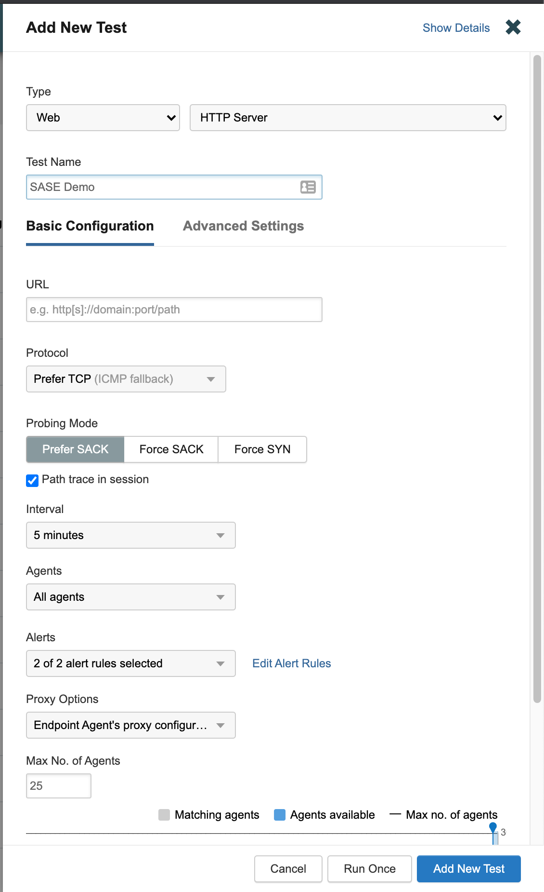
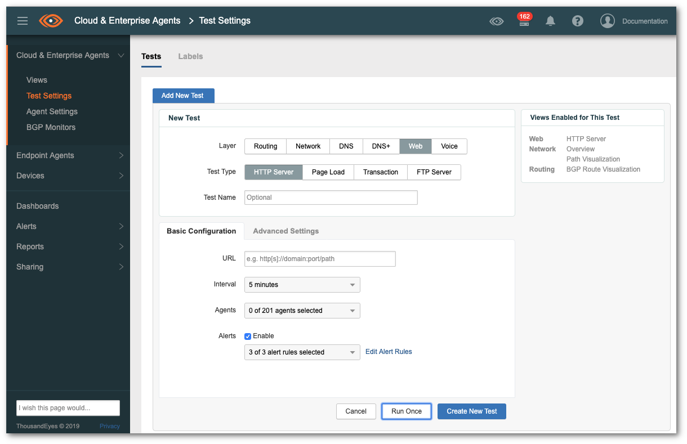

# Umbrella and ThousandEyes integration (SASE)

The goal of the integration is to test whether the policies of Umbrella are being enforced. This verification is done by Cisco ThousandEyes (using instant HTTP tests). This is important for multiple reasons. First of all, an analyst can check whether a potential harmfull destination is reachable, and thus can cause a threat (e.g. a Command&Control server). Second it can also be used to verify the policy enforcement across your organization. Cisco ThousandEyes can for example be used to verify a domain block in Cisco Umbrella, offering a good SASE use case. Obviously there are more use cases that this is usefull for.

## Features
* Searches for group_id of agents to start instant test from;
* Creates HTTP instant endpoint test for agents (with earlier queried group_id) to verify of domain is reachable;
* You can configure how often to rerun the test and the amount of time in between;
* Retrieves and parses test results automatically;
* If domain/URL is reachable it will send a Webex Teams notifaction to warn that policy is not enforced;
* Vice versa, if domain/URL is not reachable, it will send a confirmation via Webex Teams that policy is enforced.

> **Note:** Please test this properly before implementing in a production environment. This is a sample workflow!


## Overview ThousandEyes instant HTTP tests
The Instant Test feature can be used to troubleshoot problems without waiting for a scheduled test, or to validate a new test's configuration. Before running the Instant Test, an existing test's configurations can be adjusted, such as adding new agents or increasing timeout values. Data can be saved for later review and shared with interested parties. Follow the steps below to do this in the [ThousandEyes GUI](https://app.thousandeyes.com/):

1. To run an instant test from the [Cisco ThousandEyes dashboard](https://app.thousandeyes.com/), first log in and then navigate to **Endpoint Agents > Test Settings**.

2. Click the **Add New Test** button to display the form.

3. Select the **Test Type (Web)**.



4. Set the **Basic Configuration** and **Advanced Settings**. For more information, review [Working with Test settings](https://docs.thousandeyes.com/product-documentation/tests/working-with-test-settings). Please remember the name of the group of agents you ar using, you will need this later. For example `All agents`.

5. Select **Run Once** to run the **Instant Test**.

> **Note:** you may also do this lab with Cloud & Enterprise agents, but for the ease of testing we are using **Endpoint Agents** in this lab. To change this it will be quite easy and explained later. The steps are the same (except from clicking **Cloud & Enterprise agent**) and the test settings would then log like this:



## Installation steps for Python integration scripts

1. Clone or download this repository: 

```bash
git clode https://github.com/chrivand/thousandeyes-umbrella.git
cd thousandeyes-umbrella
ls
```

2. You can now see 4 different files that we are going to use (ignore the .md files):

* `requirements.txt`: a file for used python libraries.
* `config.json`: a configration file that stores API keys and some other parameters.
* `teapi.py`: This module provides a higher level abstraction class that allows you to query the ThousandEyes API. Compared to standard urllib3 it provides a few advantages, such as transparent handling of throttling mechanisms. This is not a Python file that we will run directly, we will import it as module in the others.
* `thousandeyes_umbrella.py`: this script can be triggered and passed a domain. It will then block the domain with Umbrella and verify the enforcement using ThousandEyes. It will then report back via Webex Teams. 

3. As you can see, the magic happens in `thousandeyes_umbrella.py`. Let's start using this script! Open this up in you favorite code editor and scroll to `line 172`. As you can see the steps that the script takes are shown here. It calls various Python functions, which we will walk through now.

4. First, let's check out the `open_config()` function. This is a short function from `line 27` that loads a `config.json` file containing API keys and some configuration parameters. It is best practice not to keep them in your script. There are more secure ways to do this, but this is just a sample script. Please treat API keys as passwords!

5. Next up is `post_umbrella_events(domain, api_key)` on `line 40`. This function takes a domain as argument, and will add this to a custom domain blocklist using the **Umbrella Enforcement API**. If this is new to you, please check the earlier labs in [the SASE learning track](https://developer.cisco.com/learning/tracks/sase). Please mind the API call that is being done. See what is happening to the domain that was passed as argument?

```python
payload = {
        "alertTime": time + "Z",
        "deviceId": "ba6a59f4-e692-4724-ba36-c28132c761de",
        "deviceVersion": "13.7a",
        "dstDomain": domain,
        "dstUrl": "http://" + domain + "/",
        "eventTime": time + "Z",
        "protocolVersion": "1.0a",
        "providerName": "Security Platform"
    }

    response = requests.post(url, data=json.dumps(payload), headers=headers)
```

6. Now on to the big one: the `create_thousandeyes_instant_test(username, api_token, test_url, test_name, no_of_reruns, time_between_reruns, aid=None)` function. This function is based on the code of the previous lab. It will combine a couple of things and is rewritten a bit though. Let's check it out.

7. Similarly like in the previous lab, we are first gathering the ID of the group of agents we want to test from (`line 67-71`): 

```python
response_json = api.get("groups/endpoint-agents", aid=aid)
    label_id = None
    for label in response_json["groups"]:
        if label["name"] == "All agents":
            label_id = label["groupId"]
```

8. We are then creating the test on `line 72-102`. We are the rerunning the test as is configured in the `config.json` file on `line 104-120`. Finally we are retrieving the results on `line 126-150`. Have a look at how we need to set the right time window to retrieve tests from on `line 129-130`. This is important, since we might otherwise miss test results. When you are running only 1 test, this time window parameter is not needed:

```python
	# set time window to retrieve test results from
    collect_time = no_of_reruns * time_between_reruns + 300
```

9. On `line 152-162` we are printing the results. If there is any test that is reporting that it is not reachable (most likely the last couple of tests), then we are setting a **boolean variable** to `False` (`line 157`).  Finally on `line 165` we are returning this boolean and the test results.

10. Now on to the last function: `send_webex_teams_message(webex_text,webex_access_token,webex_room_id)`. This function is pretty simple and just sends messages to a Webex room that is configured in the `config.json` file. To see the 2 different option of the message, check `line 191-199`. Do you understand why we are sending the different notifactions via Webex? 

11. Now it is time to run the script. For this we will need to provide some extra arguments when running the script. First, we will create a Python virtual environment though:

```python
python3.8 -m venv sase-venv
source sase-venv/bin/activate
pip install -r requirements.txt
```

12. Now that we have this out of the way, we can execute the script. Make sure you have filled in all of the API keys and parameters in the `config.json` file. Also, if you prefer to change the domain you are blocking and doing the test for, you change `line 179`:

```python
    domain = "internetbadguys.com"
```

13. After that, run the script like this:

```python
python thousandeyes_umbrella.py
```

> **Note:** if you get an error about a missing Python module, please use `pip install <module name>` to install them additionally. 

> **Note:** to avoid noise you might want to consider not sending Webex messages if the policy is enforced as expected. 

## Authors
* Christopher van der Made (Cisco)
* Primoz Secnik Kolman (Cisco)
